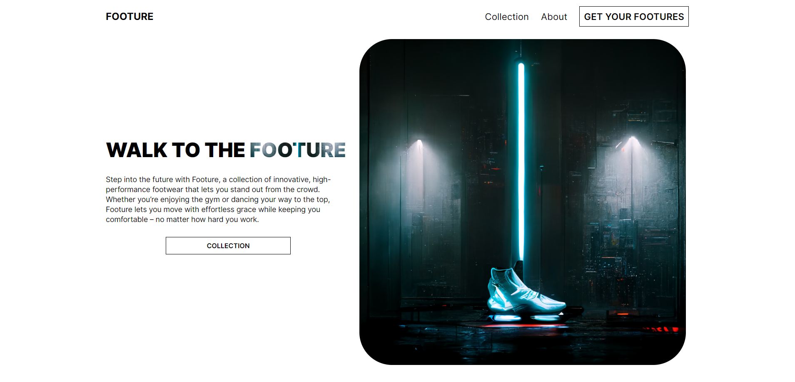
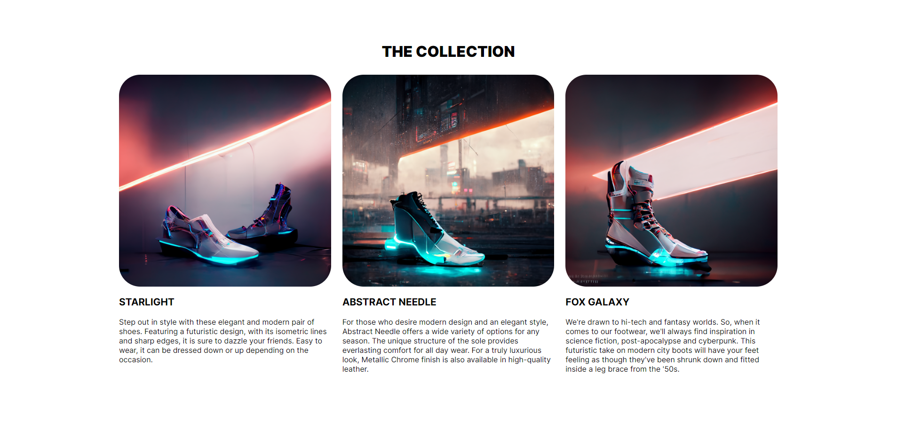
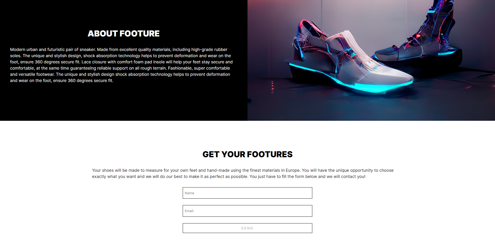

# Footure

This is one of my personal project where I wanted to put all the knowledge that I learned in a web development master and on my own. It took my 4 days to finish it. About Footure, I created a single product page focused in a futuristic pair of shoes.

## Table of Contents

* [General Info](#general-information)
* [Technologies Used](#technologies-used)
* [Features](#features)
* [Screenshots](#screenshots)
* [Contact](#contact)

## General Information

- This single product page is about an exclusive pair of shoes with cyberpunk and futuristic inspiration.
- The images are created by an AI.

## Technologies Used

- HTML5 - SASS - Javascript 

## Features

- Fully responsive
- Images generated by [Midjourney](https://midjourney.com/)

## Screenshots

 
 

 
 

## Contact

Created by [Adrian Kervin](https://www.linkedin.com/in/kervinmarquinez/) - feel free to contact!